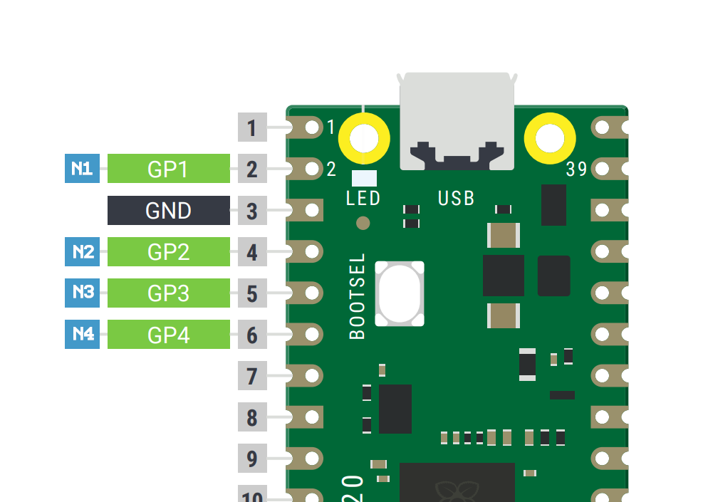

# Stepper Library for Raspberry Pi Pico

A library to control a bipolar stepper motor for the Raspberry Pi Pico board.

[](https://github.com/beshrkayali/pico_stepper/actions/workflows/cmake.yml)

## Example

An example project is available under `example` directory.

To compile, first make sure you have cloned pico-sdk somewhere on your system and that
you have set `PICO_SDK_PATH` env var to point to where you cloned it.

```sh
export PICO_SDK_PATH=/path/to/pico-sdk
```

Then:

```sh
$ git clone git@github.com:beshrkayali/pico_stepper.git
$ cd pico_stepper/example
$ mkdir build && cd build
$ cmake ..
$ make
```

This should create `stepper_example.elf` and `stepper_example.uf2` in your build directory.

Push and hold the BOOTSEL button and plug your Pico into the USB port, this will mount it as a
mass storage device called `RPI-RP2`. You can now drag and drop the `stepper_example.uf2` file onto it.
Your Pico should reboot.

The example assumes you're wiring your stepper's N1, N2, N3, N4 to
your Pico's GPIO1, GPIO2, GPIO3, GPIO4 consecutively.

```
- N1 -> GPIO1
- N2 -> GPIO2
- N3 -> GPIO3
- N4 -> GPIO4
```



If you're powering your stepper from an external source, make sure you wire
the ground from the power source to your Pico's ground.

## License

Copyright (C) Beshr Kayali.

Based on Arduino Stepper Library. Copyright (C) Arduino LLC. Copyright (C) Sebastian Gassner. Copyright (c) Noah Shibley.

This library is free software; you can redistribute it and/or modify it under the terms of the GNU Lesser General Public License as published by the Free Software Foundation; either version 2.1 of the License, or (at your option) any later version.

This library is distributed in the hope that it will be useful, but WITHOUT ANY WARRANTY; without even the implied warranty of MERCHANTABILITY or FITNESS FOR A PARTICULAR PURPOSE. See the GNU Lesser General Public License for more details.

You should have received a copy of the GNU Lesser General Public License along with this library; if not, write to the Free Software Foundation, Inc., 51 Franklin St, Fifth Floor, Boston, MA 02110-1301 USA
